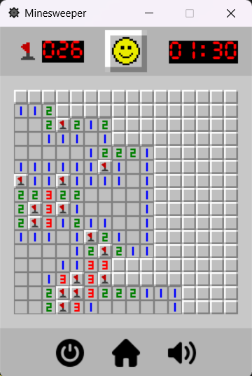
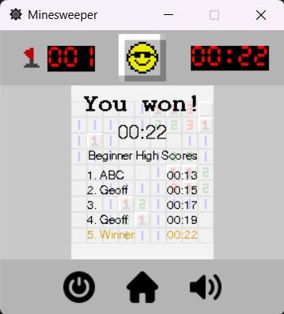
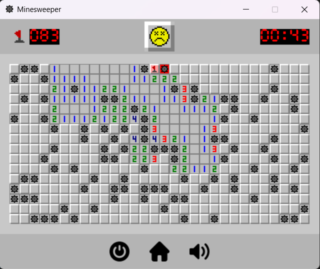
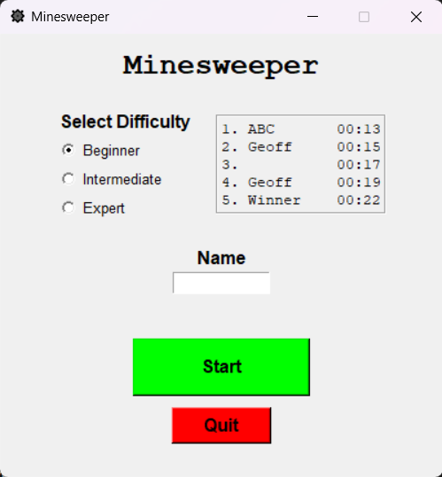

# Minesweeper
## Description
Minesweeper is a classic, easy-to-learn desktop game in which the goal is to reveal all tiles in a grid without hitting any mines.
This is my implementation of Minesweeper, built entirely with Python and the [Pygame](https://www.pygame.org/docs/) and
[Tkinter](https://docs.python.org/3/library/tkinter.html#module-tkinter) libraries.
## Features
### Simple gameplay faithful to the original

### Keep track of high scores

### Challenge yourself with different difficulties

### Clean user interface

## Installation Instructions
### Run from Source
* Ensure you are using **Python version 3.7?** or higher. (Not exactly sure where the cutoff is; sorry.)
    * `python --version`
* Run `pip install -r requirements.txt` from the root directory to install all required packages.
* To start the program, run `python src/main.py` from the root directory.
### Executable
* Work in progress. Check back later!
## How to Play
* In the startup menu, select a difficulty:
    * Beginner: 9x9 grid, 10 mines
    * Intermediate: 16x16 grid, 40 mines
    * Expert: 16x30 grid, 99 mines
* (Optional) Enter a name to be saved with your high scores.
* Click "Start."
* Click any tile in the grid to get started. You'll never hit a mine on your first click!
* When you click a tile, all surrounding tiles will be revealed until a tile is reached with an adjacent mine.
* The numbers on uncovered tiles tell you how many mines are adjacent to that tile in a 3x3 area.
* If you think a tile has a mine underneath, you can "flag" the tile with the *right* mouse button.
    * Remove a flag by right-clicking it again.
    * The counter in the top-left corner displays the number of mines minus the number of flagged tiles.
* If you reveal every tile that is not a mine, you win! Your name and time will be added to `data/highscores.txt`.
* To restart with the same difficulty, click the button with the yellow face.
* To return to the startup menu, click the home button at the bottom of the window.
* To toggle sound on/off, click the volume button at the bottom of the window.
    * This setting will save between sessions in `data/settings.txt`.
## Credits
### Textures
* home.png: https://www.flaticon.com/free-icons/home-button
* quit.png: https://www.flaticon.com/free-icons/turn-off
* sound_on.png: https://www.flaticon.com/free-icons/volume
* sound_mute.png: https://www.flaticon.com/free-icons/mute
* tile_atlas.png: https://commons.wikimedia.org/wiki/File:Minesweeper_simple_texture_atlas.png
### Fonts
* courier_new_bd.ttf: https://fontzone.net/font-details/courier-new-bold#google_vignette
* helvetica.ttf: Helvetica Neue Font Family by Von Der Tann
* timer.ttf: Cursed Timer ULiL by heaven castro
### Sounds
* explosion.mp3: Explosion by Pixabay
* flag_place.mp3: Sci Fi Glitch Sound by Pixabay
* tile_click.mp3: Bottle Pop by Pixabay
* victory.mp3: 8-Bit Victory Sound by Pixabay
